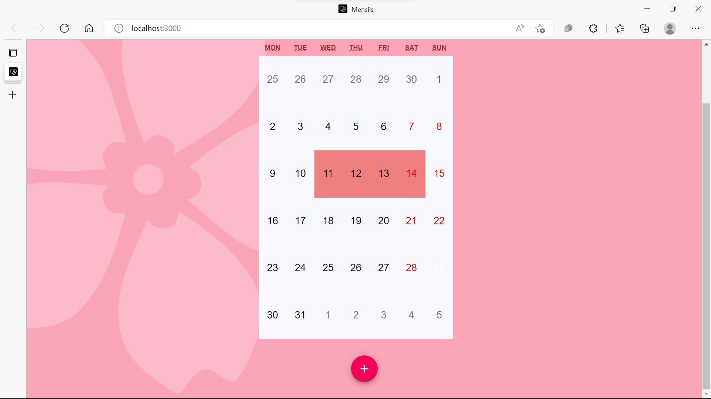
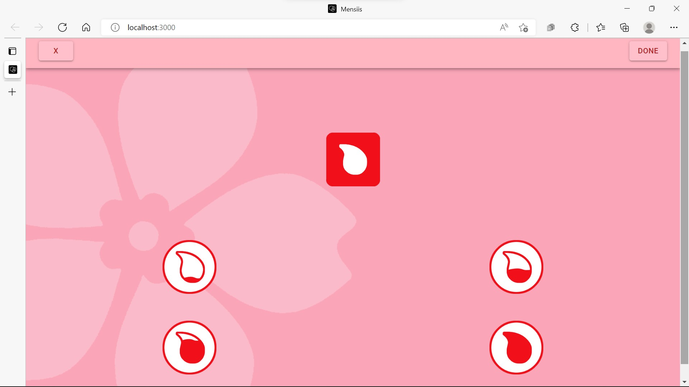
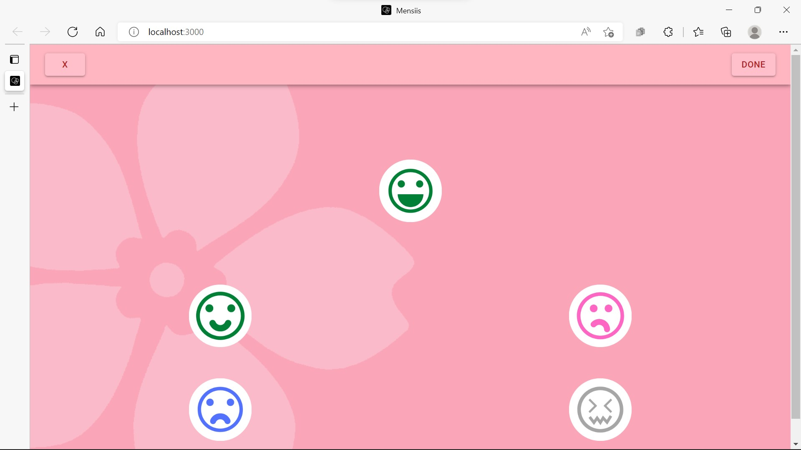
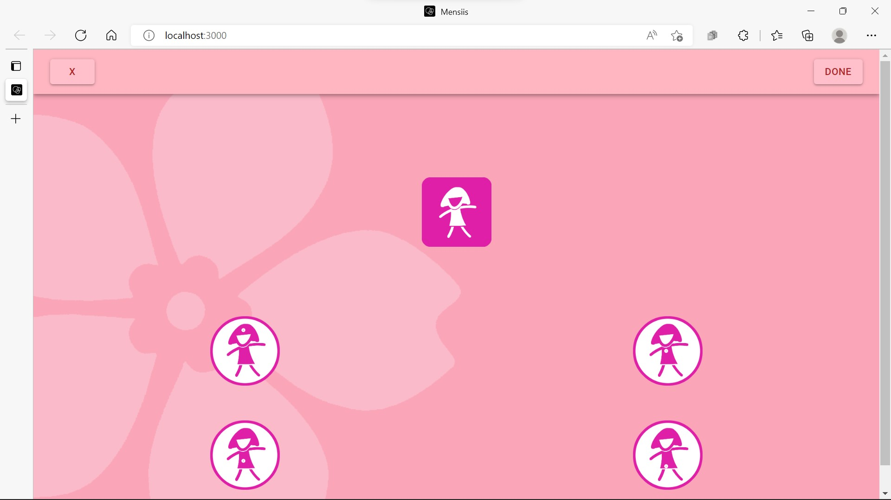
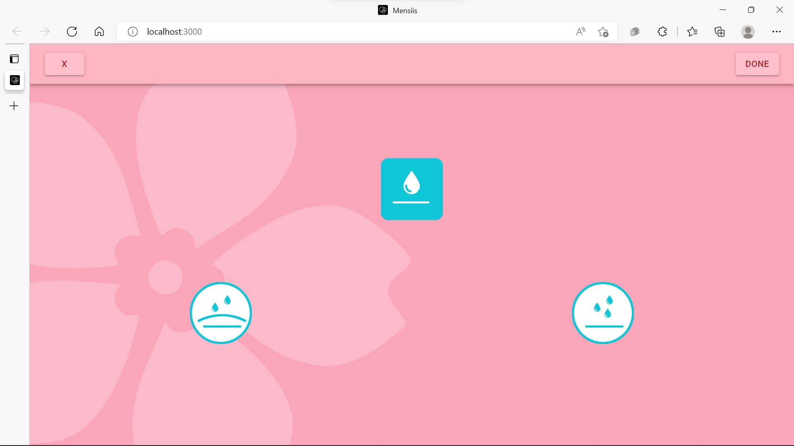

# Mensiis


A multifunctional period tracker that records menstrual cycles, provide medicine reminder and mental condition enlightenment.


## Deployment

### deploy to local host

```shell
npm install
npm start
```

### deploy to github page

```shell
npm install
npm run deploy
```

# Home Page



# Bleed Page 



# Mood Page



# Pain Page



# Sex Page




## Reference

- [material-ui](https://material-ui.com/getting-started)

## Function Call

- index.js
  - App.js
    - Home.js
    - Add.js


## Contact

* Mayur Asodara - [linkedIn profile](https://www.linkedin.com/in/mayur-asodara-366067206), email_id - mayurasodara@gmail.com


